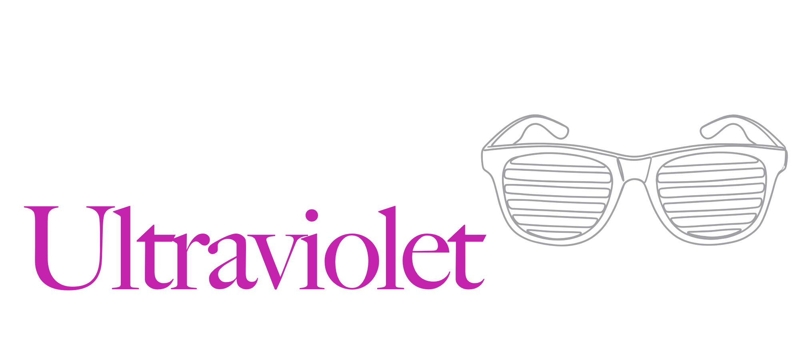

<p>
    <a href="charming_ultraviolet.png"></a><br>
    <a href="https://crates.io/crates/charming-ultraviolet"></a>
    <a href="https://github.com/coderbants/charming-ultraviolet/actions"></a>
</p>

# Charming Ultraviolet (`charming-ultraviolet`)

**Charming Ultraviolet** is a complete, from-scratch Rust port of [Ultraviolet](https://github.com/charmbracelet/ultraviolet), Charmbracelet's set of primitives for manipulating terminal emulators — cell-based screen buffers, a diffing terminal renderer, and cross-platform input decoding. It tracks upstream on a rolling basis, with crate versions mirroring the upstream Go pseudo-version pins, and a hard goal of **1:1 behavioral parity**: the same escape sequences, cell semantics, and rendering output, favoring fidelity to upstream over Rust-native rewrites whenever the two would diverge.

It's part of the Charming port family of the Bubble Tea ecosystem and builds on [charming-x-ansi](https://github.com/coderbants/charming-x-ansi) (ANSI primitives) and [charming-colorprofile](https://github.com/coderbants/charming-colorprofile) — it powers [charming-bubbletea](https://github.com/coderbants/charming-bubbletea), [charming-lipgloss](https://github.com/coderbants/charming-lipgloss) and [charming-bubbles](https://github.com/coderbants/charming-bubbles).

Ultraviolet is a set of primitives for manipulating terminal emulators, with a focus on terminal user interfaces (TUIs). It provides a set of tools and abstractions for interaction that can handle user input and display dynamic, cell-based content. It's the product of many years of research, development, collaboration and ingenuity.

Ultraviolet is not a framework by design, however it can be used standalone to create powerful terminal applications. It's in use in production and powers critical portions of [Bubble Tea v2][bbt] and [Lip Gloss v2][lg], and was instrumental in the development of [Crush][crush].

[crush]: https://github.com/charmbracelet/crush
[bbt]: https://github.com/charmbracelet/bubbletea
[lg]: https://github.com/charmbracelet/lipgloss

> [!CAUTION]
> This project currently exists to serve internal use cases. API stability is a goal, but expect no stability guarantees as of now.


## Installation

```sh
cargo add charming-ultraviolet
```

Ultraviolet provides cell-based screen buffers, a diffing terminal renderer and
cross-platform input decoding for building terminal user interfaces.

## Quick start

A minimal full-screen application: enter the alternate screen, draw a centered
message, and exit on any key press.

```rust
use charming_ultraviolet::decoder::DecodedEvent;
use charming_ultraviolet::screen::clear;
use charming_ultraviolet::screen_context::new_context;
use charming_ultraviolet::terminal::default_terminal;
use charming_ultraviolet::terminal_screen::TerminalScreen;

fn draw(scr: &mut TerminalScreen) {
    clear(scr);
    let bounds = scr.bounds();
    let w = scr.string_width("Hello, World!");
    let x = (bounds.dx() as i64 - w as i64) / 2;
    let y = bounds.dy() as i64 / 2;
    new_context(Box::new(&mut *scr)).draw_string("Hello, World!", x, y);
    scr.render();
    let _ = scr.flush();
}

fn main() {
    let mut t = default_terminal();
    t.screen().enter_alt_screen();
    if let Err(e) = t.start() {
        eprintln!("error: {e}");
        std::process::exit(1);
    }

    draw(t.screen());

    loop {
        match t.events().recv() {
            Ok(DecodedEvent::KeyPress(_)) => break,
            Ok(_) => {}
            Err(_) => break,
        }
    }

    draw(t.screen()); // last render before exit
    let _ = t.stop();
}
```

For a longer walkthrough — window resize handling, the inline (non-alternate)
screen, mouse events, and drawing with `Drawable` components — see
[TUTORIAL.md](./TUTORIAL.md), and the [examples](https://github.com/coderbants/charming-ultraviolet/tree/dev/examples)
directory for complete programs.

## Features

Ultraviolet is built with several core features in mind to make terminal
application development easy and performant:

### 👺 The Cursed Renderer

The cell-based rendering model—called _The Cursed Render_—was inspired by the infamous
[ncurses](https://invisible-island.net/ncurses/) library, which has been an
essential part of terminal applications for decades. Ultraviolet takes this
concept and modernizes it for the Go programming language, providing a more
ergonomic and efficient way to work with terminal cells without the need for
archaic technologies like `terminfo` or `termcap` databases.

Unlike ncurses, it supports both full-window and inline use-cases as we see inline TUIs as important in maintaining user context and flow.

### 🏎️ High Speeds and Low Bandwidth

The built-in terminal renderer efficiently handles content updates by utilizing
a powerful cell-based diffing algorithm that minimizes the amount of data
written to the terminal using various ANSI escape sequences to accomplish this.
This allows applications to update only the parts of the terminal that have
changed, significantly improving performance and responsiveness.

In practical terms, Ultraviolet optimizes for fast redraws that use minimal data transfer. This is very important locally and critically important over the network (for example, via SSH).

### 💬 Universal Input

Input handling in terminals can be complex, especially when dealing with
multiple input sources, different platforms, and ancient terminal baggage.
Ultraviolet simplifies this by providing a unified interface for handling user
input, allowing developers to focus on building their applications without
getting bogged down in the intricacies of terminal input handling.

### 🎮 Cross-Platform Compatibility

Ultraviolet is designed to work seamlessly across different platforms and
terminal emulators. It abstracts away the differences in terminal capabilities
and provides a consistent API for developers to work with, ensuring that
applications built with Ultraviolet will run smoothly on various systems.

On Windows, it uses the [Windows Console API](https://learn.microsoft.com/en-us/windows/console/console-functions) to
provide a consistent experience, while on Unix-like systems, it relies on the
standard Termios API along with ANSI escape sequences to manipulate the
terminal.

In short: Ultraviolet provides first-class support for both Unix and Windows-based systems.

### 🧩 Extensible Architecture

Ultraviolet is built with extensibility in mind, providing a solid API that can
be embedded into other applications or used as a foundation for building custom
terminal user interfaces. It allows developers to create their own components,
styles, and behaviors, making it a versatile tool for building terminal
applications.

## FAQ

### 🐈 What about other Charm libraries?

Ultraviolet is not a replacement for existing libraries like [Bubble Tea](https://github.com/charmbracelet/bubbletea) or [Lip
Gloss](https://github.com/charmbracelet/lipgloss). Instead, it serves as a
foundation for the latest versions of both of these libraries and others like them, providing the
underlying primitives and abstractions needed to build terminal user interfaces
applications and frameworks.

### 🛁 How is it different from Bubble Tea?

Ultraviolet is a lower-level library that focuses on the core primitives of
terminal manipulation, rendering, and input handling. It provides the building
blocks for creating terminal applications, while Bubble Tea is a higher-level
framework that builds on top of Ultraviolet to provide a more structured and
opinionated way to build terminal user interfaces.

### 💋 Is it a replacement for Lip Gloss?

Simply put, no. Ultraviolet is not a replacement for Lip Gloss. Instead, it
provides the underlying rendering capabilities that Lip Gloss can use to create
styled terminal content. Lip Gloss is a higher-level library that builds on top
of Ultraviolet by utilizing the cell-based rendering model to provide a
simplified and ergonomic way to create styled terminal content and composition
of terminal user interfaces.

## ✏️ Tutorial

You can find a simple tutorial on how to create a UV application that displays
"Hello, World!" on the screen in the [TUTORIAL.md](./TUTORIAL.md) file.

## Whatcha think?

We’d love to hear your thoughts on this project. Feel free to drop us a note!

- [Twitter](https://twitter.com/charmcli)
- [Discord](https://charm.land/discord)
- [Slack](https://charm.land/slack)
- [The Fediverse](https://mastodon.social/@charmcli)

## License

[MIT](./LICENSE)

